## Advanced Lane Lines Finding

### The aim of this project is to create a pipeline that detect the lane lines on the road.

---

**Advanced Lane Finding Project**

The goals / steps of this project are the following:

### Outline 

* Compute the camera calibration matrix and distortion coefficients given a set of chessboard images.
* Apply a distortion correction to raw images.
* Use color transforms, gradients, etc., to create a thresholded binary image.
* Apply a perspective transform to rectify binary image ("birds-eye view").
* Detect lane pixels and fit to find the lane boundary.
* Determine the curvature of the lane and vehicle position with respect to center.
* Warp the detected lane boundaries back onto the original image.
* Output visual display of the lane boundaries and numerical estimation of lane curvature and vehicle position.
* Video pipeline
* Discussion

### Below I will explain and describe how I addressed each point in the outline.  

---

### Camera Calibration

### 1. Compute the camera calibration matrix and distortion coefficients given a set of chessboard images.

The code for this step is contained in the first 5 code cells of the IPython notebook located in "./Line Detection Pipeline.ipynb"

To calibrate the camera a chessboard was used. The chessboard had 9 x 6 inner corners, as shown below:

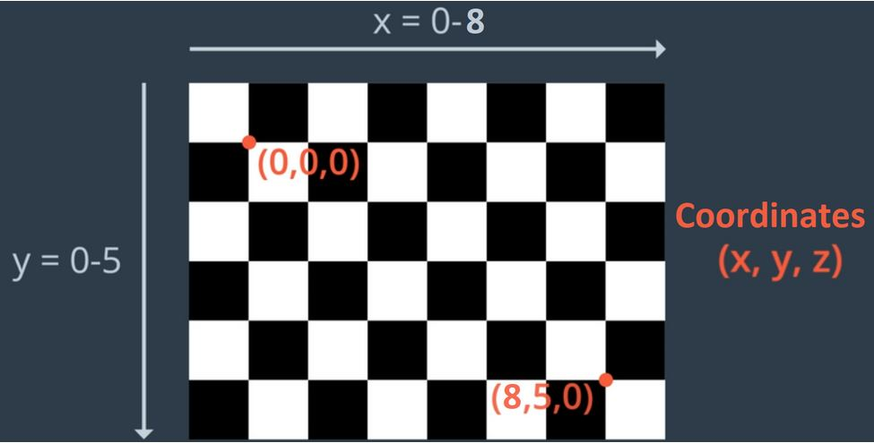

Then a function was created to get the object points (3D) and the image points (2D). To visualize the output of this part a pandas dataframe was implemented as shown below for one of the chessboard images:

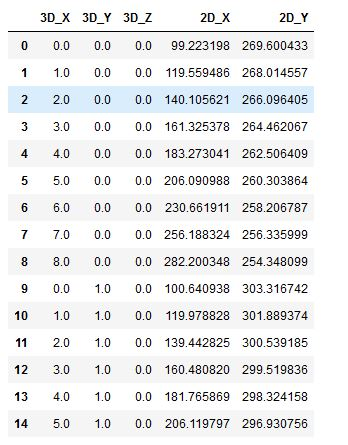

* Once the object and image points were taken, a camera matrix and its distortion coefficients were obtained. 

### 2. Apply a distortion correction to raw images.

* Then the camera matrix and distortion coefficients were used to undistord all future images taken by this camera. To show a brief example of the undistortion, please see the below image:

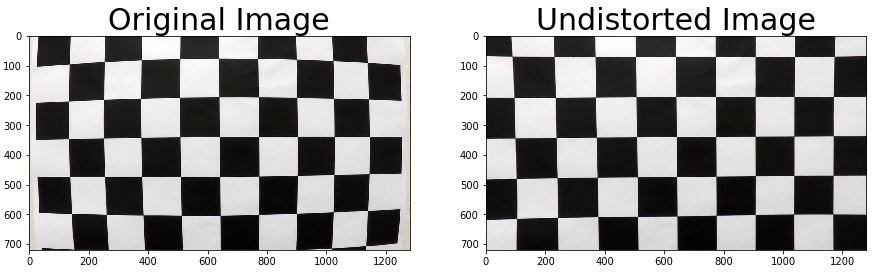

Below you can also find another undistortion image. This time from the camera mounted on the car.

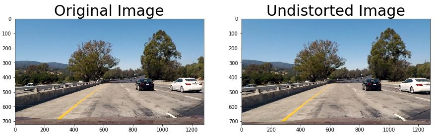

### 3. Use color transforms, gradients, to create a thresholded binary image.

This part of the code has also been implemented in the "./Line Detection Pipeline.ipynb" notebook. 

The pipeline in this section was as follows:

   * Convert to HLS color space and take the saturation channel. Even though the function here was implemented with the capability to threshold the values in saturation, for this project it was not used. In other words, the whole saturation channel was extracted intact.  
   * Create two functions that were created based on the sobel gradient. They are the magnitude and orientation of the gradient. In this case it was thresholded in the range of (20, 150) for the magnitude and in the range of (0.7, 1.3) for the orientation of the gradient.
   * Input the saturation channel in 1st step and combine all the gradient thresholds to get a binary image, as shown below for one of the test images:
    
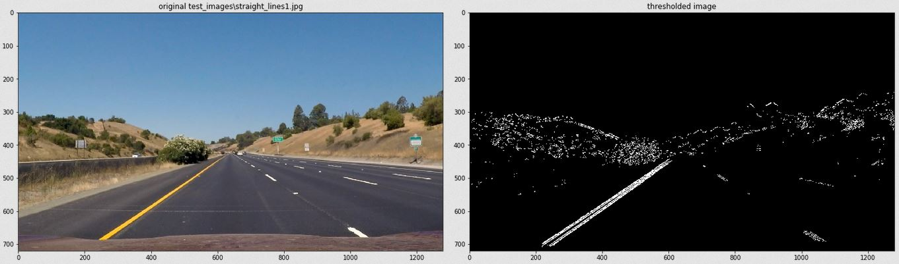    
    
### 4. Apply a perspective transform to rectify binary image ("birds-eye view").

This part of the code has also been implemented in the "./Line Detection Pipeline.ipynb" notebook. 

In this section we follow the below steps:

   * Created a function to draw the coordinates of 4 points on an image. This allows us to 
        visualize the points we want to select for our perspective transform. 

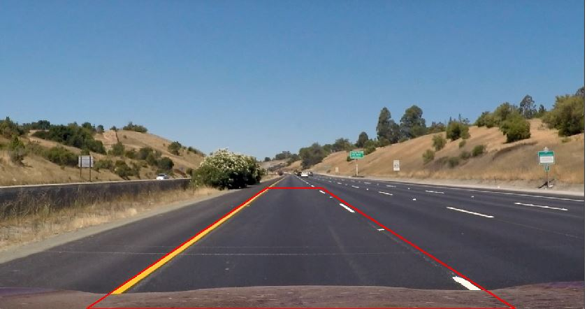  

   * These 4 source points were used together with 4 destination arbitrary points selected to warp the image into a top-down view as shown below:

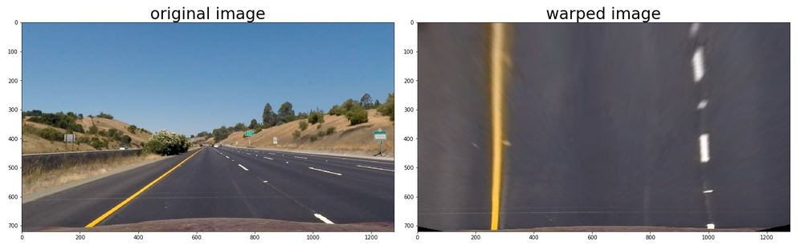

This resulted in the following source and destination points:

| Source        | Destination   | 
|:-------------:|:-------------:| 
| 585, 455      | 250, 0        | 
| 705, 455      | 1000, 0       |
| 190, 720      | 250, 720      |
| 1130, 720     | 1000, 720     |

Another example but with the thersholded binary image is shown below:

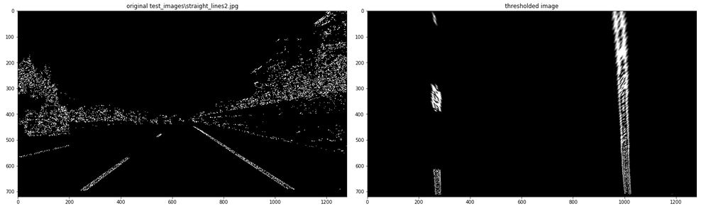

   * Of course in the image above we first got the perspective transform matrix as well as the inverse perspective transform matrix. Later we use the inverse matrix to provide a way to go back to the original image perspective as shown below:
    
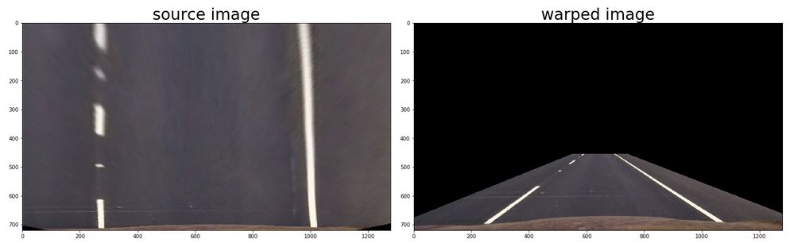    

### 5. Detect lane pixels and fit to find the lane boundary.

This part of the code has also been implemented in the "./Line Detection Pipeline.ipynb" notebook. However, a lot of helper functions were used, which are located at "./helpers.py" file  

In this section we follow the below steps:

  * Use histogram peaks technique to identify initial points on the line
  * We propagate this initial points obtained with the help of the sliding window technique as shown below:
  
  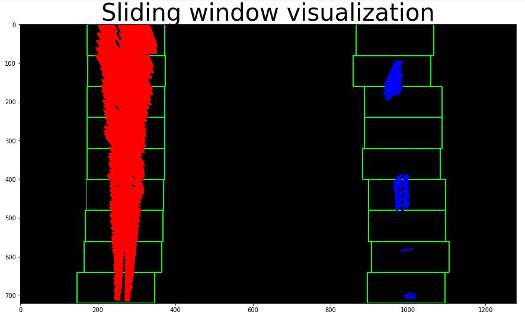
  * Then we fit the points inside the windows with a polynomial of 2nd order as shown below:
  
  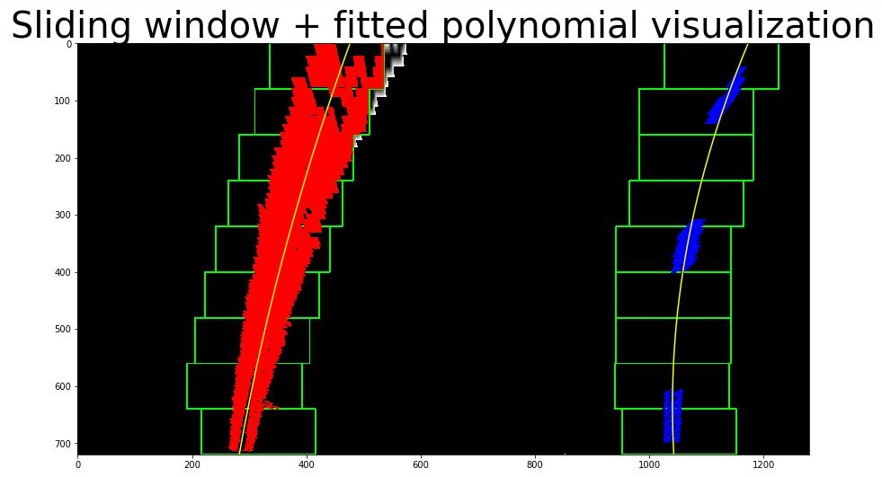
  * We also implement a function to detect the following frames based on previous polynomial coefficients as shown below:
  
  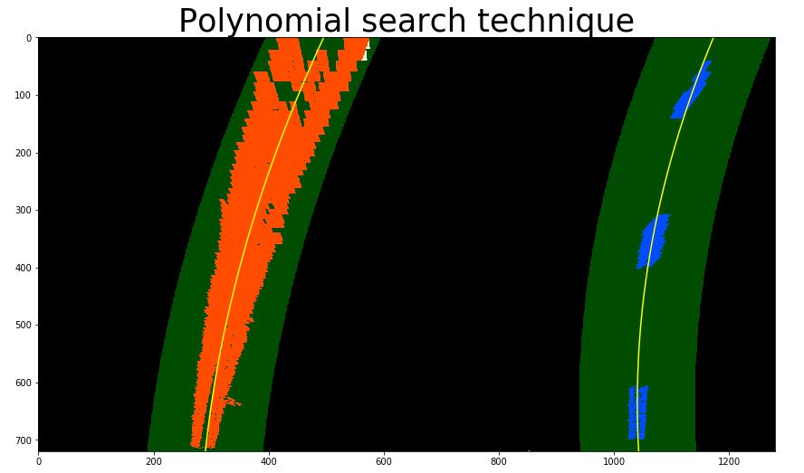
  Nevertheless, This last function was not implemented in the final pipeline. It is leaved here for optimizing the algorithm in future work.
  
### 6. Determine the curvature of the lane in pixels and meters

This part of the code has also been implemented in the "./Line Detection Pipeline.ipynb" notebook. However, a lot of helper functions were used, which are located at "./helpers.py" file  

In this section we follow the below steps:
  * With the help of the fitted polynomial the radius of curvature was obtained throught the following equation:
  
  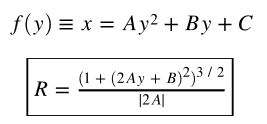
  * The polynomial was fitted again however it was done based on a conversion from pixels to real-world measurements. In other words, the polynomial was fed with values that are in meters instead of pixels. The algorithm was tested on all the testing images obtaining the following results:
  
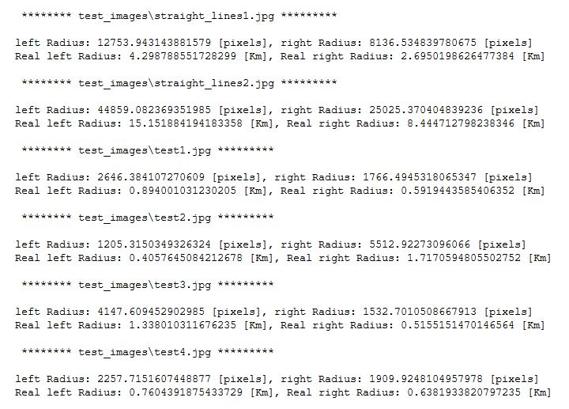

### 7. Warp the detected lane boundaries back onto the original image and compute the vehicle's position with respect to the center of the lane. Output visual display of the lane boundaries and numerical estimation of lane curvature and vehicle position.

This part of the code has also been implemented in the "./Line Detection Pipeline.ipynb" notebook. However, a lot of helper functions were used, which are located at "./helpers.py" file 

In this section we follow the below steps:
  * Use the fitted polynomial and the inverse matrix obtained in section 4 to convert back to the original perspective and draw a green polygon on the original image. as shown below:
  
  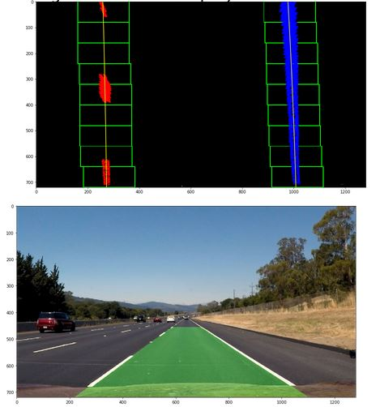
  * Calculate the vehicle's position related to the center of the lane. We then output the results on the original image together with the green polygon obtained in the step above.
  
  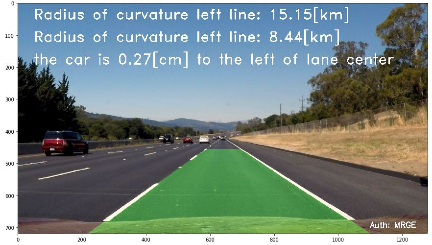

### 7. Video pipeline

The resulted video was uploaded to the following location: [video address](https://youtu.be/6zJiRspWwNU)

### 8. Discussion

* The short-term future work for this project will be to optimize the algorithm since now it takes some time to compute and find the lines. A function was already implemented for this. However, it was not included in the final pipeline. This was explained in section 5.
* Another future work will be to implement a low pass filter as well as other techniques such as a gaussian blur to suppress noise and outliers
